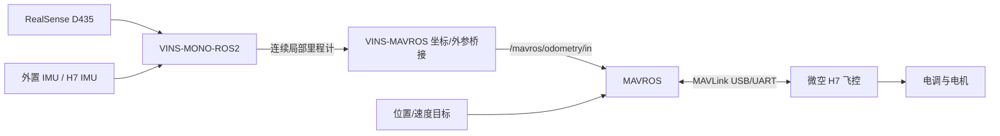

# ARM-VINS

ARM-VINS 是面向 ARM64 机载计算平台的 ROS 2 视觉惯性定位工作区。本项目以 RK3588 为上位机、微空 H7 飞控为下位机、Intel RealSense D435 为视觉传感器，通过 MAVROS 建立 MAVLink 通信，在 RK3588 上运行 VINS/VSLAM，并将连续的视觉惯性里程计送入飞控，为无 GNSS 或弱 GNSS 环境下的定点与稳定悬停提供外部定位。

> **安全边界**：H7 飞控负责姿态、速度和位置闭环，RK3588 负责相机/IMU处理、VINS 状态估计、外部视觉注入和上层目标管理。不要绕过飞控直接用 ROS 节点控制电机。

## 1. 系统架构



推荐的数据链路：

```text
RealSense D435 + external IMU
    -> feature_tracker
    -> vins_estimator
    -> continuous local odometry
    -> body-frame extrinsic and ENU/FLU conversion
    -> /mavros/odometry/in
    -> H7 EKF external vision fusion
    -> H7 position controller
    -> stable hover
```

用于飞控融合的位姿必须来自 VINS 的**连续局部输出**。回环优化后的全局位姿可能发生跳变，不应直接送入飞控位置控制器。

## 2. 工作区结构

```text
SparkCar_ROS2_WS
├── SparkCar_Perception
│   └── src
│       └── VINS-MONO-ROS2
│           ├── camera_model       # 相机模型与标定工具
│           ├── config_pkg         # 相机、IMU 与 VINS 参数
│           ├── feature_tracker    # 特征跟踪前端
│           ├── vins_estimator     # 视觉惯性估计器
│           ├── pose_graph         # 回环检测与位姿图优化
│           ├── benchmark_publisher
│           └── ar_demo
├── SparkCar_Controller
│   └── src
│       └── target_follower        # 现有地面车目标跟随节点，不属于飞行控制链路
├── SparkCar_Navigation            # 预留/其他平台导航组件
├── SparkCar_Tools                 # 辅助工具
└── README.md
```

MAVROS 通常通过 Ubuntu/ROS 软件源安装，不作为本仓库源码编译。当前仓库中未包含专用的 VINS-MAVROS 外参和坐标系桥接节点；接入真实飞行前必须补充或确认该节点。

## 3. 推荐环境

已面向以下环境组织：

- RK3588 / ARM64（aarch64）
- Ubuntu 22.04
- ROS 2 Humble
- 微空 H7 飞控（需运行支持 MAVLink 和外部视觉融合的固件）
- Intel RealSense D435（VINS 使用其中一路图像）
- 与 D435 图像时间同步的外置 IMU（可来自 H7，但必须验证时间戳与延迟）
- MAVROS / MAVLink

建议 RK3588 使用性能模式并配置足够散热。VINS 编译和运行均会持续占用 CPU 与内存。

## 4. 硬件连接

### 4.1 RealSense D435 与 IMU

标准 D435 提供彩色、双目红外和深度数据，但**不带 IMU**；带 IMU 的型号是 D435i。因此，本项目使用标准 D435 时，VINS 还需要一路外置 `sensor_msgs/msg/Imu`。

推荐优先级：

1. 与 D435 硬件同步并完成联合标定的独立 IMU；
2. H7 IMU 经 MAVROS 发布到 `/mavros/imu/data_raw`，但必须实测通信延迟和时间同步；
3. 如果实际设备是 D435i，则使用 RealSense 的 gyro/accel 合成 IMU 话题，不要套用标准 D435 配置。

D435 通过 USB 3 接入 RK3588，避免使用低质量延长线或带宽不足的 USB Hub。检查连接速率：

```bash
lsusb -t
```

D435 应工作在 `5000M` USB 3 链路。VINS-Mono 只使用一路图像，不直接使用深度数据。深度流可留给避障或目标测距，但会增加 USB 带宽和 RK3588 负载。

D435 可选择：

- 彩色图像：常见话题为 `/camera/camera/color/image_raw`，易于调试，但彩色传感器为滚动快门；
- 左红外图像：常见话题为 `/camera/camera/infra1/image_rect_raw`，单色且为全局快门，更适合快速运动，但必须使用对应红外相机的独立标定参数。

不要把彩色相机内参用于红外图像，也不要在完成标定后改变分辨率。VINS 要求：

- 图像时间戳与 IMU 时间戳处于同一时基；
- IMU 频率建议不低于 100 Hz；
- 图像频率建议为 20～30 Hz；
- 相机内参、畸变参数准确；
- `imu -> camera` 旋转和平移外参准确；
- 相机曝光不能过长，飞行振动环境下应减少运动模糊。

### 4.2 RK3588 与 H7 飞控

推荐使用飞控的 MAVLink USB 或独立 TELEM 串口连接 RK3588：

```text
RK3588 TX -> H7 RX
RK3588 RX -> H7 TX
RK3588 GND -> H7 GND
```

使用 UART 时必须确认双方电平一致，并避免同时从多路电源反向供电。正式飞行建议保留遥控器、急停/切模能力和独立地面站链路。

## 5. 安装依赖

```bash
sudo apt update
sudo apt install -y \
  build-essential \
  cmake \
  git \
  python3-colcon-common-extensions \
  libeigen3-dev \
  libopencv-dev \
  libceres-dev \
  libgoogle-glog-dev \
  libsuitesparse-dev \
  ros-humble-rclcpp \
  ros-humble-cv-bridge \
  ros-humble-image-transport \
  ros-humble-camera-info-manager \
  ros-humble-realsense2-camera \
  ros-humble-tf2 \
  ros-humble-tf2-ros \
  ros-humble-tf2-geometry-msgs \
  ros-humble-nav-msgs \
  ros-humble-sensor-msgs \
  ros-humble-visualization-msgs \
  ros-humble-mavros \
  ros-humble-mavros-extras
```

安装 MAVROS GeographicLib 数据：

```bash
sudo /opt/ros/humble/lib/mavros/install_geographiclib_datasets.sh
```

如果 ARM64 软件源中没有 `ros-humble-realsense2-camera`，需按照 RealSense ROS Wrapper 的 Ubuntu 22.04/ARM64 方法从源码编译 `librealsense` 和 `realsense2_camera`。驱动启动后，D435 应发布 `sensor_msgs/msg/Image`；标准 D435 的 IMU 必须由外置设备单独提供。

## 6. 编译

本仓库包含多个独立 ROS 2 工作区。VINS 位于 `SparkCar_Perception`：

```bash
cd /home/orangepi/Desktop/SparkCar_ROS2_WS/SparkCar_Perception
source /opt/ros/humble/setup.bash

colcon build \
  --symlink-install \
  --cmake-args -DCMAKE_BUILD_TYPE=Release \
  --parallel-workers 2
```

RK3588 内存较小时建议保持 `--parallel-workers 1` 或 `2`，避免并行编译 Ceres/VINS 时触发 OOM。

编译完成后加载环境：

```bash
source /opt/ros/humble/setup.bash
source /home/orangepi/Desktop/SparkCar_ROS2_WS/SparkCar_Perception/install/setup.bash
```

检查程序是否安装：

```bash
ros2 pkg executables feature_tracker
ros2 pkg executables vins_estimator
ros2 pkg executables pose_graph
```

### ROS 2 Humble 的 `rclcpp::Duration` 兼容修复

若 `ar_demo` 出现以下错误：

```text
no matching function for call to rclcpp::Duration::Duration(int)
```

将：

```cpp
rclcpp::Duration(0)
```

改为消息类型的零初始化：

```cpp
builtin_interfaces::msg::Duration()
```

对应文件通常为：

```text
SparkCar_Perception/src/VINS-MONO-ROS2/ar_demo/src/ar_demo_node.cpp
```

如果飞行链路不使用 AR Demo，也可先跳过该包：

```bash
colcon build \
  --packages-skip ar_demo \
  --symlink-install \
  --cmake-args -DCMAKE_BUILD_TYPE=Release \
  --parallel-workers 2
```

## 7. VINS 配置

不要直接使用仓库中的 RealSense 示例配置进行实机飞行。建议复制：

```text
config_pkg/config/realsense/realsense_color_config.yaml
```

并保存为独立的 `d435_h7_config.yaml`。如果使用 D435 彩色图像和 H7 经 MAVROS 输出的 IMU，话题通常配置为：

```yaml
imu_topic: "/mavros/imu/data_raw"
image_topic: "/camera/camera/color/image_raw"
output_path: "/home/orangepi/vins_output/"

estimate_extrinsic: 0
estimate_td: 0
rolling_shutter: 1
loop_closure: 0
```

不同版本的 RealSense ROS Wrapper 也可能发布 `/camera/color/image_raw`。必须以 `ros2 topic list` 的实际结果为准。如果改用左红外全局快门图像，则将 `image_topic` 改为实际的 `infra1` 话题，并重新标定红外相机内参与 IMU 外参，同时设置：

```yaml
rolling_shutter: 0
rolling_shutter_tr: 0
```

关键参数：

- `image_topic`：实际图像话题；
- `imu_topic`：实际 IMU 话题；
- 相机模型、分辨率、内参与畸变：必须来自当前相机标定；
- `extrinsicRotation`、`extrinsicTranslation`：相机到 IMU 的刚体外参；
- `acc_n`、`gyr_n`、`acc_w`、`gyr_w`：来自 IMU 噪声标定；
- `td`：图像和 IMU 的时间偏差；
- `rolling_shutter`：必须与传感器真实类型一致；
- `loop_closure`：悬停外部视觉建议关闭，或仅用于建图显示，不把回环修正结果输入飞控。

创建输出目录：

```bash
mkdir -p /home/orangepi/vins_output/pose_graph
```

## 8. 启动 MAVROS

先确认串口设备：

```bash
ls -l /dev/ttyUSB* /dev/ttyACM* 2>/dev/null
```

将当前用户加入串口组，重新登录后生效：

```bash
sudo usermod -aG dialout "$USER"
```

根据 H7 实际固件选择 MAVROS 启动文件。以下串口和波特率仅为示例：

PX4：

```bash
source /opt/ros/humble/setup.bash
ros2 launch mavros px4.launch \
  fcu_url:=serial:///dev/ttyUSB0:921600
```

ArduPilot：

```bash
source /opt/ros/humble/setup.bash
ros2 launch mavros apm.launch \
  fcu_url:=serial:///dev/ttyUSB0:921600
```

不同 MAVROS 安装版本的 launch 文件名可能不同，可先检查：

```bash
ros2 pkg prefix mavros
ls /opt/ros/humble/share/mavros/launch
```

检查飞控连接：

```bash
ros2 topic echo /mavros/state
ros2 topic hz /mavros/imu/data
ros2 service list | grep mavros
```

`/mavros/state` 应持续更新，并显示 `connected: true`。

## 9. 启动相机与 VINS

### 9.1 检查传感器

启动 D435：

```bash
source /opt/ros/humble/setup.bash
ros2 launch realsense2_camera rs_launch.py
```

VINS 只需要一路图像。正式运行时可在确认驱动参数后关闭不需要的点云和深度处理，以降低 USB、CPU 和内存负载。先查看当前驱动的实际话题：

```bash
ros2 topic list | grep camera
```

再检查 D435 图像与外置 IMU。以下示例采用新版 RealSense 命名和 H7 MAVROS IMU：

```bash
ros2 topic hz /camera/camera/color/image_raw
ros2 topic echo /camera/camera/color/image_raw --once

ros2 topic hz /mavros/imu/data_raw
ros2 topic echo /mavros/imu/data_raw --once
```

如果 `/mavros/imu/data_raw` 不存在，检查 MAVROS IMU 插件、H7 数据流配置和实际话题名。标准 D435 本身不会发布 IMU 话题。

### 9.2 启动 VINS 前端和估计器

```bash
source /opt/ros/humble/setup.bash
source /home/orangepi/Desktop/SparkCar_ROS2_WS/SparkCar_Perception/install/setup.bash

export VINS_CONFIG=/home/orangepi/Desktop/SparkCar_ROS2_WS/SparkCar_Perception/src/VINS-MONO-ROS2/config_pkg/config/realsense/d435_h7_config.yaml
```

若当前分支的节点以 `config_file` ROS 参数读取 YAML，可分别启动：

```bash
ros2 run feature_tracker feature_tracker \
  --ros-args -p config_file:="$VINS_CONFIG"

ros2 run vins_estimator vins_estimator \
  --ros-args -p config_file:="$VINS_CONFIG"
```

也可以使用仓库提供的 launch 文件。编译后先列出实际文件名：

```bash
find install -path '*/share/*/launch/*' -type f
```

再按实际 launch 参数启动，避免把 EuRoC、D435i 或其他相机的示例配置误用于标准 D435 实机。

VINS 上电后需要适当的平移和转动完成初始化。首次测试应拆除桨叶，手持整机缓慢运动，确认尺度、重力方向、姿态和速度输出正常后再进入飞行测试。

## 10. VINS 接入 MAVROS

推荐使用 MAVROS odometry 插件：

```text
VINS nav_msgs/msg/Odometry
    -> 时间戳检查
    -> camera/IMU 到飞行器机体系外参
    -> ROS ENU/FLU 坐标约定
    -> covariance 填充
    -> /mavros/odometry/in
```

检查 MAVROS 输入类型：

```bash
ros2 topic type /mavros/odometry/in
ros2 interface show nav_msgs/msg/Odometry
```

桥接节点应满足：

- 输入为 VINS 的连续局部 `nav_msgs/msg/Odometry`；
- 输出为 `/mavros/odometry/in`；
- 发布频率稳定，建议 30 Hz 以上；
- 时间戳单调递增且延迟稳定；
- `frame_id` 和 `child_frame_id` 定义明确；
- 位姿和速度代表飞行器机体，而不是未经变换的相机坐标系；
- 设置合理的 pose/twist covariance；
- VINS 未初始化、跟踪丢失、时间戳异常时停止注入并通知飞控降级。

如果使用 `/mavros/vision_pose/pose`，发布类型必须为 `geometry_msgs/msg/PoseStamped`，并且仍需先完成相机位姿到机体位姿的外参转换。不能仅靠改话题名解决坐标系问题。

> 当前仓库未发现上述专用桥接节点。在补齐桥接实现并完成台架验证之前，不要将 VINS 直接用于自动悬停。

## 11. 飞控配置原则

微空 H7 可能运行不同飞控固件，具体参数名应以固件版本和厂商手册为准。至少需要完成：

1. 校准陀螺仪、加速度计、磁力计、遥控器和电调；
2. 配置连接 RK3588 的串口为 MAVLink，并设置一致的波特率；
3. 启用外部视觉位置/速度融合；
4. 设置正确的视觉传感器位置和方向；
5. 配置外部视觉失效后的降级行为；
6. 保留遥控器接管、切模和上锁能力；
7. 在地面站确认 EKF 接受外部视觉且无创新异常后，才允许进入定点模式。

不要同时让两套来源竞争同一个位置控制输入。首次测试建议通过遥控器或地面站切换飞行模式，不要自动解锁和自动起飞。

## 12. 推荐启动顺序

首次联调必须拆除桨叶：

1. 上电 H7，保持未解锁；
2. 启动相机和 IMU 驱动；
3. 启动 MAVROS，确认 `connected: true`；
4. 启动 VINS，手持运动完成初始化；
5. 检查 VINS 位姿、速度、方向和延迟；
6. 启动 VINS-MAVROS 桥接；
7. 在地面站检查外部视觉融合状态和 EKF 创新；
8. 抬起并转动机体，确认飞控估计方向与真实运动一致；
9. 安装桨叶，在防护环境下进行低高度人工起飞；
10. 确认状态稳定后，由遥控器切入定点/外部视觉模式测试悬停。

## 13. 运行检查

```bash
# MAVROS 连接和飞控状态
ros2 topic echo /mavros/state
ros2 topic echo /mavros/extended_state

# D435 图像与 H7 IMU 频率
ros2 topic hz /camera/camera/color/image_raw
ros2 topic hz /mavros/imu/data_raw

# VINS 输出（以实际话题为准）
ros2 topic list | grep -E 'vins|odometry|camera_pose'
ros2 topic hz /vins_estimator/odometry
ros2 topic echo /vins_estimator/odometry --once

# 输入飞控的外部视觉
ros2 topic hz /mavros/odometry/in
ros2 topic echo /mavros/odometry/in --once

# TF 检查
ros2 run tf2_ros tf2_echo odom base_link
```

重点观察：

- 静止时位置是否缓慢漂移；
- 向前、向右、向上移动时坐标符号是否正确；
- 原地偏航时姿态方向是否正确；
- VINS 与飞控时间戳差值是否稳定；
- 飞控是否持续接受外部视觉，而不是反复切换或拒绝融合；
- 跟踪丢失后飞控是否按照预设策略降级。

## 14. 常见问题

### MAVROS 未连接

```bash
ls -l /dev/ttyUSB0
groups
dmesg | tail -n 30
```

检查串口设备、权限、波特率、TX/RX 接线和飞控端口协议。

### VINS 无法初始化

- 检查图像与 IMU 是否持续发布；
- 确认设备确实是标准 D435 还是 D435i；标准 D435 没有内置 IMU；
- 使用 H7 IMU 时检查 MAVROS 时间同步、传输延迟和消息抖动；
- 检查时间戳是否来自同一时基；
- 增加有视差的平移和多轴旋转；
- 检查相机内参、IMU 噪声和相机-IMU 外参；
- 避免纯旋转、弱纹理、过曝、欠曝和运动模糊。

### 定点后快速发散或方向相反

立即切回姿态模式并人工接管。重点检查 ENU/NED、FLU/FRD、相机光学坐标系、机体外参以及飞控视觉传感器方向配置。

### 悬停缓慢漂移

检查 VINS 尺度、IMU 零偏、振动、时间同步和飞控 EKF 参数。不要先通过增大位置环增益掩盖定位问题。

### 回环时飞行器突然修正

说明把带回环跳变的位姿送进了控制链路。飞控应使用连续局部里程计；回环结果只用于建图、显示或高层全局定位。

### RK3588 运行负载过高

- 使用 `Release` 编译；
- 降低不必要的可视化和图像保存；
- 关闭飞行不需要的 `ar_demo`、benchmark 和 RViz；
- 合理降低图像分辨率，但必须同步更新相机标定；
- 关闭 D435 不使用的点云和深度后处理；
- 检查 CPU 温度、降频和内存占用。

## 15. 安全须知

- 所有首次联调、坐标系验证和解锁测试都应拆除桨叶；
- 不要在人员、车辆或易损设备附近测试；
- 保留遥控器人工接管、切模和紧急上锁通道；
- VINS 未初始化或跟踪质量不足时禁止进入依赖外部视觉的模式；
- 对图像中断、IMU 中断、MAVLink 中断和 RK3588 重启分别测试失效保护；
- 从低高度、短时间悬停开始，逐步扩大测试范围；
- 上位机崩溃时，H7 必须能够独立执行安全降级或降落策略。

## 16. License

本仓库包含多个来源的组件。总体许可见 [LICENSE](LICENSE)，第三方组件以各自目录中的许可证为准。
